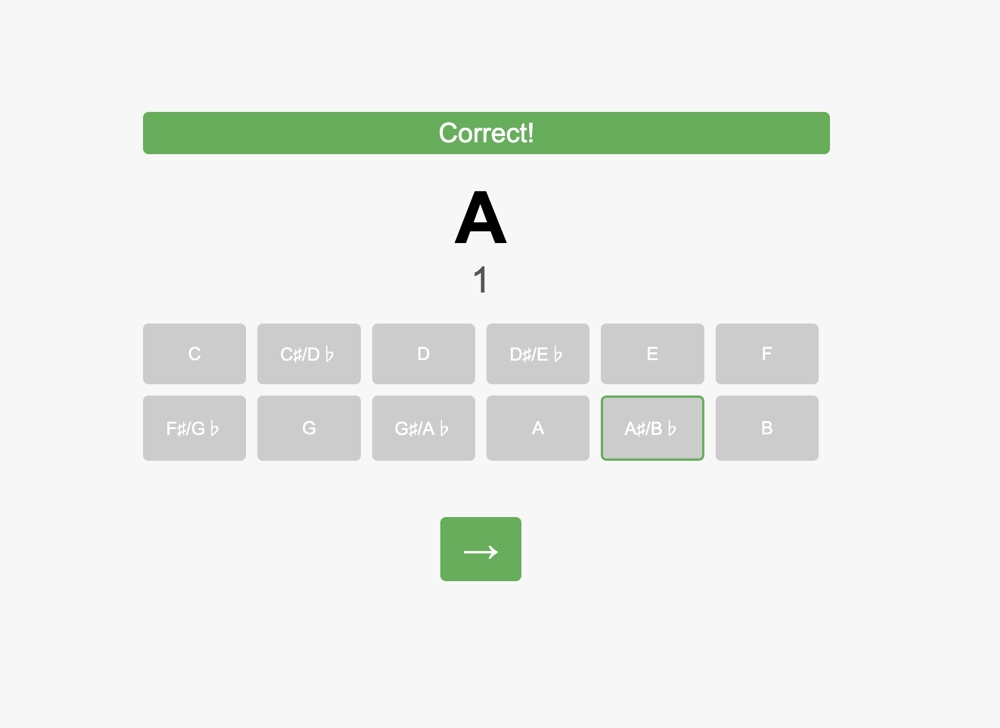

# Interval Trainer

I wanted to get better at what I call "music mental math," mostly so I could get faster at transposing chords on guitar. The problem usually goes "hey Stephen, what chord is 6 half steps from A," which usually results in blank stares from me and some counting for about 10 seconds, and I may or may not be correct.

Enter the trainer!

My idea was if I made a tool that asked me a ton of these questions, my brain would create some type of algorithm to figure this out.

The CSS was almost exclusively written by ChatGPT LOL. Which kind of concerns me but 🤷‍♂️.
